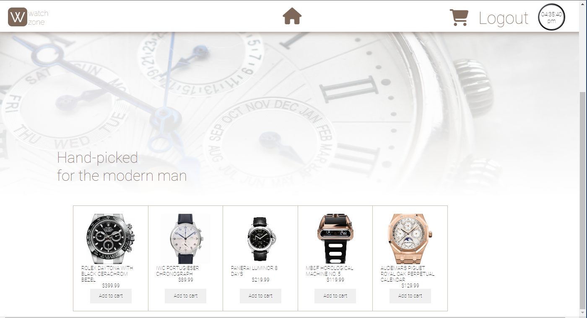

# Ecommerce Store for Watches
  - A proof of concept for an e-commerce site that utilizes a back-end features. 

# Features for the Project:
-----------------------------------------------------------------------
- The website displays users visiting the home page with items to select for their purchase.
- When the user wants to buy an item, it prompts the user to log in or register page. 
- Once the user logs in and selects a watch, they can click on the “Cart”, which prompts the user to review their selection in the cart. 
- Users will have the chance to delete items from the cart.  When the user logs out and logs back in the data in the cart is saved allowing the user to continue from where they left off. 
- In addition, users will have the option to add the number of items that they want to purchase. 
 
  
# Built with
-----------------------------------------------------------------------
- Node.js and Express.js to create a RESTful API.Css
- Handlebars.js as the template engine
- MySQL and the Sequelize ORM for the database.
- Day.JS for timer 
- API keys and sensitive information with environment variables
- HTML 
- CSS

# Links
-----------------------------------------------------------------------
- [Deployed Website](https://lit-scrubland-39844.herokuapp.com)
- [Repository](https://github.com/YehOkiHub/EcommerceStore)

# Screenshot sample
-----------------------------------------------------------------------
 

# Usage:
-----------------------------------------------------------------------
An eCommerce website with backend technologies that will allow clients to add and customize their databases.

# Place Holder:
-----------------------------------------------------------------------
- 
- 

# Collaborators:
### [Micky Adera] (https://github.com/Micky-Ad)
### [Brian Collins] ( https://github.com/briancollins02)

